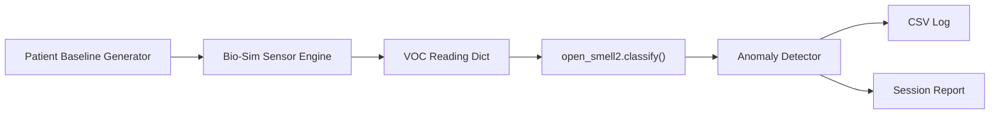

# OpenSmell — Simulation Validation Brief

**The Christman AI Project | Luma Cognify AI**  
**Author:** Everett Nathaniel Christman  
**Document version:** 1.0 — July 4, 2026  
**Status:** Screening-support simulation validation (not clinical diagnostic validation)

---

## Executive Summary

OpenSmell is a volatile organic compound (VOC) screening-support engine that maps sensor readings to condition profiles across cancer, neurological, metabolic, infectious, and psychiatric categories. This document describes how to reproduce simulation validation runs, how metrics are defined, and what the current verified results show.

**Key claim for reviewers:** The continuous testing loop (`opensmell_test_loop.py`) and the production classifier (`open_smell2.py`) share a **single classification engine**. There is no parallel or divergent classifier in the simulation path.

| Verified benchmark (seed 42) | Result |
|---|---|
| Live sensor-grounded profiles | 21 |
| Total simulation cycles | 100 |
| Targeted injection profile | `alzheimers` @ 50% inject rate |
| **Injection accuracy** | **100.0%** (19 hits / 19 injected cycles) |
| Detection rate | 99.0% |
| Alert rate | 10.0% |
| Duration | 3 seconds (turbo mode) |

Source report: `opensmell_report_20260704_091519.txt`

---

## Regulatory & Ethical Position

OpenSmell is **not FDA-approved** and is **not intended for clinical diagnosis**. It is screening-support software only. Biological signals are client-owned and are never harvested, sold, or commodified.

Profiles whose VOC markers are not yet sensor-grounded are flagged `research_only` and **excluded from live matching**. Five profiles currently fall in this category: melanoma, multiple sclerosis, lupus, autism (preliminary), and schizophrenia (preliminary).

---

## System Architecture



### Component roles

| File | Role |
|---|---|
| `open_smell2.py` | Profile database, marker→sensor alias map, `classify()` engine |
| `opensmell_bio_sim.py` | Biologically realistic VOC simulation (log-normal, co-variance, diurnal phase, noise) |
| `opensmell_test_loop.py` | Continuous test harness — delegates classification to `open_smell2` |
| `test_open_smell2.py` | Unit + integration test suite (16 tests) |
| `run_test.sh` | Configurable benchmark runner |

### Sensor channels (20 physical channels)

`acetone`, `isoprene`, `ammonia`, `benzene`, `alkanes`, `aldehydes`, `hydrocarbons`, `dimethyl_sulfide`, `sulfur`, `aliphatic_acids`, `skatole`, `ketones`, `sebum_vocs`, `lipid_oxidation`, `ethanol_trace`, `toluene`, `ethane`, `propanol`, `butane`, `methane_trace`

Descriptive profile markers (e.g. `acetone_breath`, `benzene_derivatives`) are resolved to these channels via `MARKER_ALIASES` in `open_smell2.py` before matching.

---

## Live Profile Inventory (21 profiles)

| Profile key | Condition | Category | Sensor signature |
|---|---|---|---|
| `lung_cancer` | Lung Cancer | cancer | alkanes, benzene, aldehydes |
| `breast_cancer` | Breast Cancer | cancer | aliphatic_acids, hydrocarbons |
| `colorectal_cancer` | Colorectal Cancer | cancer | ammonia, sulfur, skatole |
| `ovarian_cancer` | Ovarian Cancer | cancer | aldehydes, hydrocarbons |
| `prostate_cancer` | Prostate Cancer | cancer | aldehydes, ketones |
| `bladder_cancer` | Bladder Cancer | cancer | ammonia |
| `parkinsons` | Parkinson's Disease | neurological | sebum_vocs, aldehydes |
| `alzheimers` | Alzheimer's Disease | neurological | lipid_oxidation |
| `diabetes_type1` | Diabetes (Type 1) | metabolic | acetone |
| `diabetes_type2` | Diabetes (Type 2) | metabolic | acetone |
| `liver_disease` | Liver Disease | metabolic | dimethyl_sulfide |
| `renal_failure` | Renal Failure | metabolic | ammonia |
| `ketoacidosis` | Ketoacidosis | metabolic | acetone, propanol |
| `covid19` | COVID-19 | infectious | isoprene, aldehydes |
| `tuberculosis` | Tuberculosis | infectious | alkanes |
| `c_diff` | C. difficile | infectious | aliphatic_acids |
| `sepsis` | Sepsis | infectious | aliphatic_acids |
| `rage_cortisol` | Rage / Cortisol Spike | psychiatric | acetone, isoprene |
| `depressive_spiral` | Depressive Spiral | psychiatric | dimethyl_sulfide, acetone |
| `fight_or_flight` | Fight-or-Flight Escalation | psychiatric | isoprene, ammonia |
| `pre_seizure` | Pre-Seizure / Fit Warning | psychiatric | ammonia, alkanes |

---

## Classification Methodology

### Confidence formula

For each live profile, the classifier computes:

```
coverage       = matched_channels / required_channels
mean_intensity = average intensity of matched channels (≥ 0.3 detect threshold)
confidence     = coverage × mean_intensity
```

A profile is returned as a match when `confidence ≥ 0.2` (minimum match threshold). Results are sorted by confidence descending; top 10 returned to the test loop.

### Alert threshold

Each profile has a default `confidence_threshold` of **0.7**. An alert fires when the top match meets or exceeds this threshold. Detection and alert are distinct metrics — a condition can be detected without triggering an alert.

### Known overlap behavior

Profiles that share sensor channels can compete for the top match. For example, `tuberculosis` (alkanes only) can outscore `lung_cancer` (alkanes + benzene + aldehydes) when all three lung markers are present, because shorter signatures achieve full coverage with fewer channels. This is documented behavior, not a silent failure.

---

## Simulation Methodology

### Biological realism layers (`opensmell_bio_sim.py`)

1. **Log-normal intensity** — VOC concentrations cluster low with occasional spikes (not flat uniform random).
2. **Personal patient baseline** — each cycle generates a unique chemical fingerprint.
3. **VOC co-variance** — biologically correlated compounds shift together.
4. **Diurnal phase variation** — morning / afternoon / evening / night modulate compound classes.
5. **Background noise** — trace environmental VOCs that match no profile.

### Targeted injection (validation mode)

When `--inject <profile>` is set, the simulator elevates that profile's sensor channels to 0.55–0.95 intensity at the configured inject rate. Non-injected cycles continue with background biology. This enables controlled recall measurement against a known ground-truth label.

### Patient demographics

Sex is locked by biologically authoritative profiles (e.g. prostate → male, breast/ovarian → female). Age is skewed older for cancer and neurodegenerative profiles. Demographics are counted only on injected cycles to avoid corrupting targeted test statistics.

---

## Metrics Definitions

| Metric | Definition | Grant relevance |
|---|---|---|
| **Injection accuracy** | % of injected cycles where top match `profile_id` equals the injected profile key | Primary controlled recall metric |
| **Detection rate** | % of cycles where any profile matched (confidence ≥ 0.2) | Pipeline sensitivity |
| **Alert rate** | % of cycles where top match confidence ≥ profile threshold (0.7) | Clinical action trigger rate |
| **No-match cycles** | Cycles with zero classifier matches | Baseline / noise floor |
| **Injected cycles** | Cycles where the simulator actually fired an injection | Denominator for injection accuracy |

Injection accuracy is only reported when `injected_cycles > 0`.

---

## Reproducibility — Step by Step

### Prerequisites

```bash
pip install colorama
```

Python 3.10+ recommended. No hardware required for simulation mode.

### Step 1 — Run unit and integration tests

```bash
python3 test_open_smell2.py
```

Expected: `Ran 16 tests` — all OK.

### Step 2 — Run a seeded targeted validation

```bash
python3 opensmell_test_loop.py \
  --cycles 100 \
  --inject alzheimers \
  --inject-rate 0.5 \
  --speed turbo \
  --seed 42
```

Expected output includes:
- `Classifier: open_smell2 (21 live profiles)`
- `Injection Accuracy: 100.0% (19 hits / 19 injected cycles)`
- Report file: `opensmell_report_YYYYMMDD_HHMMSS.txt`
- Log file: `opensmell_log.csv` (appended)

### Step 3 — Run a full benchmark via shell runner

Edit `INJECT` in `run_test.sh`, then:

```bash
chmod +x run_test.sh
./run_test.sh
```

Default config: 1000 cycles, turbo speed, 40% inject rate.

### Step 4 — Verify single-engine integration

```bash
python3 -c "
from opensmell_test_loop import classify_vocs, INJECTION_PROFILES
from open_smell2 import PROFILE_SIGNATURES
assert set(INJECTION_PROFILES) == set(PROFILE_SIGNATURES)
reading = {'lipid_oxidation': 0.88}
assert classify_vocs(reading)[0]['profile_id'] == 'alzheimers'
print('Single-engine integration verified.')
"
```

### Legacy inject aliases (backward compatible)

| Legacy key | Resolves to |
|---|---|
| `diabetes_t1t2` | `diabetes_type1` |
| `cortisol_spike` | `rage_cortisol` |
| `serotonin_drop` | `depressive_spiral` |
| `adrenaline_surge` | `fight_or_flight` |
| `neurological_prefit` | `pre_seizure` |

---

## Output Artifacts

Each session produces:

| Artifact | Contents |
|---|---|
| `opensmell_report_*.txt` | Publication-ready summary: rates, category breakdown, demographics, injection accuracy |
| `opensmell_log.csv` | Per-cycle audit trail: timestamp, patient demographics, top match, confidence, severity, alert, raw VOCs |

CSV columns: `timestamp`, `sex`, `year_of_birth`, `age`, `top_match`, `category`, `confidence`, `severity`, `alert_triggered`, `action`, `raw_vocs`

---

## Limitations (Stated Plainly)

1. **Simulation only.** Current validation uses biologically modeled VOC data, not clinical breath samples or live MQ-135 hardware reads.
2. **21 live profiles, not 2,400+.** The README references a target corpus size; the sensor-grounded live set is 21 profiles as of this document.
3. **Screening-support, not diagnosis.** Confidence scores indicate signature overlap, not confirmed disease state.
4. **Shared-channel ambiguity.** Overlapping sensor signatures can cause top-match competition between related profiles.
5. **Alert threshold is conservative.** Default 0.7 threshold means many detections do not trigger alerts — by design.

---

## Suggested Grant Reviewer Checklist

- [ ] Run `python3 test_open_smell2.py` — confirm 16/16 pass
- [ ] Run seeded validation command (Step 2 above) — confirm injection accuracy reported
- [ ] Inspect `opensmell_log.csv` — confirm per-cycle audit trail
- [ ] Verify `opensmell_test_loop.py` imports `classify` from `open_smell2` (single engine)
- [ ] Confirm `research_only` profiles are excluded from `PROFILE_SIGNATURES` in `open_smell2.py`

---

## Contact

**Everett Nathaniel Christman**  
Founder — The Christman AI Project  
Operating under Luma Cognify AI

© 2025–2026 The Christman AI Project. All Rights Reserved.
